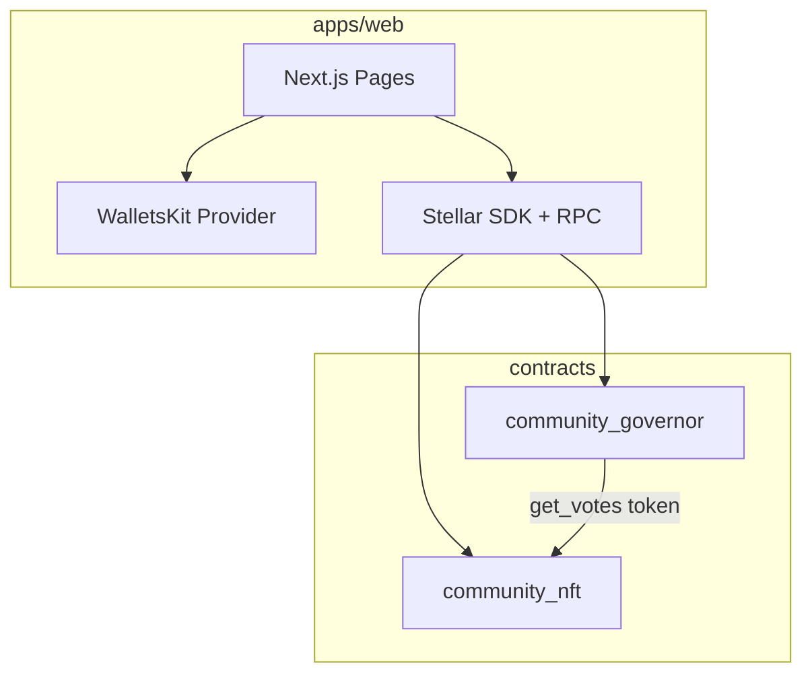

# Stolla Architecture

## System Overview

Stolla is a monorepo with Soroban smart contracts and a Next.js dApp. MVP deploys one community NFT collection and one Governor on Stellar testnet.



## Contract Architecture

### community_nft

OpenZeppelin `NonFungibleVotes` + `Votes` + `Ownable`.

| Function | Auth | Description |
|----------|------|-------------|
| `__constructor(uri, name, symbol, owner)` | — | Set collection metadata and owner |
| `mint(to, token_uri)` | owner | Sequential mint + store IPFS URI |
| `custom_token_uri(token_id)` | — | Read per-token metadata URI |
| `delegate(delegatee)` | holder | Delegate voting power |
| `transfer` / `balance` / `owner_of` | — | SEP-0050 via trait |

### community_governor

OpenZeppelin `Governor` trait implementation (pattern from `fungible-governor`).

| Function | Auth | Description |
|----------|------|-------------|
| `__constructor(token, delay, period, threshold, quorum)` | — | Wire NFT as votes token |
| `propose(targets, values, calldata, description)` | proposer | Create proposal |
| `cast_vote(proposal_id, voter, support)` | voter | Cast For/Against/Abstain |
| `state(proposal_id)` | — | Read proposal state |
| `execute(...)` | executor | Open execution after success |
| `cancel(...)` | proposer | Proposer-only cancel |

MVP proposals use empty targets (signaling votes only).

### Deploy Order

1. Deploy `community_nft` with constructor args
2. Deploy `community_governor` with NFT address + governance params
3. Write contract IDs to `apps/web/.env.local`

## Frontend Architecture

### Stack

- Next.js 15 App Router, TypeScript, Tailwind CSS
- `@stellar/stellar-sdk` for RPC simulation and submission
- `@creit.tech/stellar-wallets-kit` for Freighter

### Routes

| Route | Purpose |
|-------|---------|
| `/` | Marketing landing (cosmic editorial; see `docs/landing-page.md`) |
| `/community` | Collection info, mint form (IPFS URI) |
| `/proposals` | Proposal list |
| `/proposals/[id]` | Vote, delegate, proposal detail |

Landing and app use separate layouts: landing has section-anchor nav; app pages show wallet connect and app navigation.

### Transaction Flow

1. Simulate contract invocation via Soroban RPC
2. Build transaction with Freighter
3. Poll `getTransaction` until success/failure
4. Refresh UI state from RPC read calls

### Config (`lib/stellar.ts`)

```typescript
export const config = {
  rpcUrl: process.env.NEXT_PUBLIC_STELLAR_RPC_URL,
  networkPassphrase: Networks.TESTNET,
  nftContractId: process.env.NEXT_PUBLIC_NFT_CONTRACT_ID,
  governorContractId: process.env.NEXT_PUBLIC_GOVERNOR_CONTRACT_ID,
};
```

## Storage Model (NFT)

| Key | Type | Description |
|-----|------|-------------|
| `Owner` | Address | Mint authority |
| `TokenUri(token_id)` | String | IPFS metadata URI per token |

## Security Considerations

- Owner-only mint (`#[only_owner]`)
- Delegation required before voting power counts
- Governor snapshot prevents flash-loan voting
- Testnet only; OZ library marked experimental
- No timelock in MVP — proposals are signaling only

## Future Extensions

- `CommunityFactory` for permissionless community creation
- Timelock + on-chain execution
- Event indexer for proposal history
- IPFS upload helper in frontend
